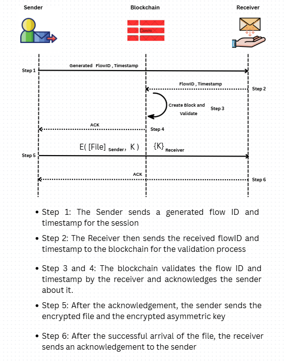

# 🔐 Secure File Transfer Protocol

This project implements a **simple and secure file transfer system** using cryptographic techniques. It ensures:
- Confidentiality (Encryption)
- Integrity (Digital Signatures)
- Replay Attack Protection (via Blockchain)
- Timestamping for freshness

---

## 🚀 Features

✨ **AES + RSA Hybrid Encryption**  
✨ **Digital Signature for Integrity Verification**  
✨ **Blockchain-based FlowID Tracking for Replay Attack Protection**  
✨ **Timestamps for Freshness Validation**

---
## 🖼 File Transfer Process Diagram

The following diagram illustrates the secure file transfer process between the **Sender** and **Receiver**, highlighting 
the use of cryptographic primitives (RSA, AES, and hashing), flowID/timestamp exchange, and blockchain-based replay protection.

  

## 🛠 Technologies Used

| Component          | Technology        | Purpose |
|-------------------|-------------------|---------|
| Symmetric Encryption | **AES (Advanced Encryption Standard)** | Fast encryption of the file content |
| Asymmetric Encryption | **RSA (Rivest-Shamir-Adleman)** | Secure key exchange and digital signing |
| Digital Signatures | **RSA with SHA-256** | Ensures the file has not been tampered |
| Replay Protection | **Custom Blockchain (Java)** | Tracks previously used flowIDs and timestamps |
| Timestamping | **System Time** | Ensures message freshness |

---

## 🔐 How Security is Achieved

### 1. **Encryption (Confidentiality)**

To protect file contents during transfer:

- A **random AES symmetric key** is generated to encrypt the file.
- This AES key is **encrypted using RSA** (receiver’s public key).
- Encrypted file + encrypted AES key are sent to the receiver.

This hybrid approach combines the **efficiency of AES** with the **security of RSA**.

---

### 2. **Integrity Protection**

To ensure the file hasn’t been tampered with:

- The sender generates a **digital signature** of the file using **RSA private key**.
- The signature is appended to the file and encrypted.
- At the receiver's end:
  - The file is decrypted.
  - The signature is verified using the **sender's RSA public key**.

If the file is altered in transit, **signature verification fails**.

---

### 3. **Replay Attack Protection**

To prevent attackers from resending the same file (a replay attack):

- Each file transfer includes:
  - A unique `flowID`
  - A `timestamp`
- These values are stored in a **simple blockchain**:
  - Before accepting a file, the receiver checks if the `flowID` already exists.
  - If it does → **Replay attack detected** and transfer is aborted.
- The blockchain maintains **an immutable list of transfers** for verification.

---

### 4. **Timestamp for Freshness**

Each block in the blockchain stores a **timestamp**. This allows:

- Detecting and logging when each file transfer happened.
- Future extensions for validating **timestamp expiration or time-based rules**.

---

